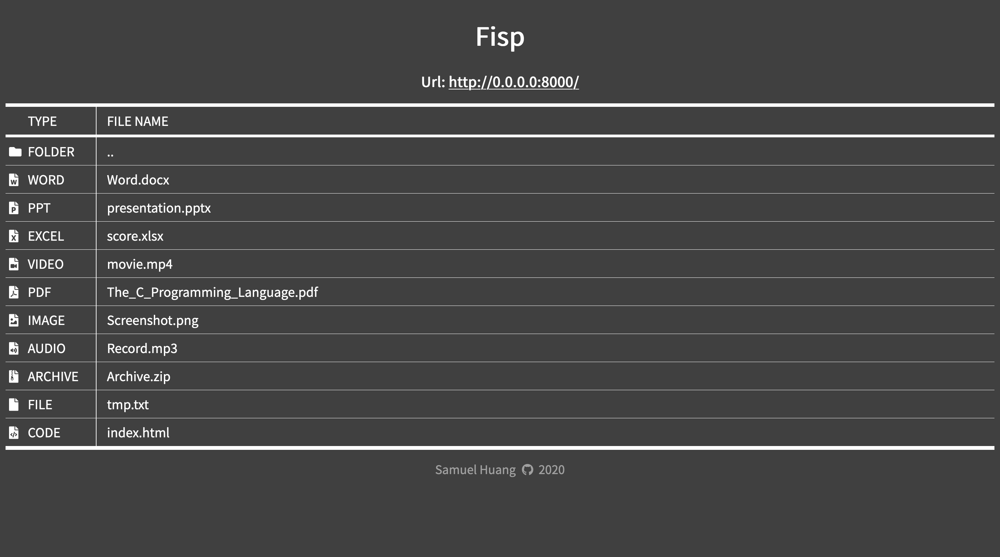

# Fisp

Modern HTTP **F**ile **I**ndexer for **S**tatic **P**age.


This project is use for static page hosting file indexer, such as github pages.  
Demo: [https://samuel.nctu.me/fisp](https://samuel.nctu.me/fisp)



## Getting Started

These instructions will get you a copy of the project up and running on your local machine for development and testing purposes. See deployment for notes on how to deploy the project on a static page.

### Prerequisites
- Your files
- Static page hosting service (ex. Github Pages)

### Installation
Copy `index.html` to every folder,
and generate `file.json` in every folder. (Instructions in [usage](#usage))

## Running the tests
It's suggested that testing this project with a file hosting server. Due to CORS policy, the website can't fetch `file.json` with XMLHttpRequest if simpily open `index.html` from file explorer.  
For example, use a python simple HTTP server:  
`$ python -m SimpleHTTPServer`

## Usage
After copied `index.html` to every folder, we need `file.json` in every folder too, in order make it be able to recognize which files is located in this directory.  
The file `file.json` is an array, consisting different objects, each representing a file or folder. It may look like this:  
```json
[
    {"type": "folder",
     "name": ".."},
    {"type": "word",
     "name": "Word.docx"},
    {"type": "ppt",
     "name": "presentation.pptx"}
]
```
Every objects have two data, *type* and *name*, if the *type* is one of the following one, webpage will display a specific icon, otherwise, it'll display *file* icon.

| Type | Icon |
| ------ | ----------- |
| word |  |
| ppt |  |
| excel |  |
| video |  |
| pdf |  |
| image |  |
| code |  |
| audio |  |
| file |  |
| folder |  |

See [docs](https://github.com/samuel21119/fisp/tree/master/docs) for more details about `file.json`.


## Todo
 - [] Write `file.json` generator.

## Built With

* HTML 5 and CSS 5
* [FontAwesome](https://fontawesome.com/) - File types icons.

## Author

* [Samuel Huang (黃恩明)](https://samuel.nctu.me)

## License

This project is licensed under the MIT License - see the [LICENSE.md](LICENSE.md) file for details


